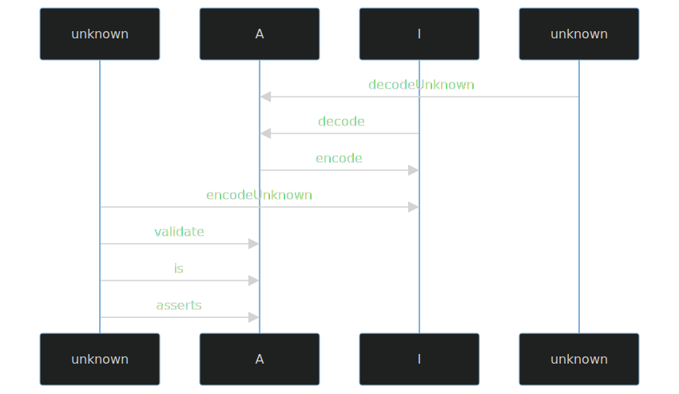

import { Aside } from "@astrojs/starlight/components"

Welcome to the documentation for `@effect/schema`, **a library for defining and using schemas** to validate and transform data in TypeScript.

`@effect/schema` allows you to define a `Schema<Type, Encoded, Context>` that provides a blueprint for describing the structure and data types of your data. Once defined, you can leverage this schema to perform a range of operations, including:

| Operation       | Description                                                                                                         |
| --------------- | ------------------------------------------------------------------------------------------------------------------- |
| Decoding        | Transforming data from an input type `Encoded` to an output type `Type`.                                            |
| Encoding        | Converting data from an output type `Type` back to an input type `Encoded`.                                         |
| Asserting       | Verifying that a value adheres to the schema's output type `Type`.                                                  |
| Arbitraries     | Generate arbitraries for [fast-check](https://github.com/dubzzz/fast-check) testing.                                |
| JSON Schemas    | Create JSON Schemas based on defined schemas.                                                                       |
| Equivalence     | Create [Equivalences](https://effect-ts.github.io/effect/docs/schema/Equivalence.ts.html) based on defined schemas. |
| Pretty printing | Support pretty printing for data structures.                                                                        |

<Aside type="caution" title="Pre-Release Notice">
  This is a pre-release version. Expect possible breaking changes and
  inconsistencies until the stable release (v1.0) is achieved.
</Aside>

## The Schema Type

The `Schema` type represents an **immutable** value that describes the structure of your data:

```ts showLineNumbers=false
Schema<Type, Encoded, Requirements>
```

The `Schema` type has three type parameters with the following meanings:

| Parameter        | Description                                                                                                                                                                                                                                                                                                        |
| ---------------- | ------------------------------------------------------------------------------------------------------------------------------------------------------------------------------------------------------------------------------------------------------------------------------------------------------------------ |
| **Type**         | Represents the type of value that a schema can succeed with during decoding.                                                                                                                                                                                                                                       |
| **Encoded**      | Represents the type of value that a schema can succeed with during encoding. By default, it's equal to `Type` if not explicitly provided.                                                                                                                                                                          |
| **Requirements** | Similar to the [`Effect`](https://effect.website/docs/docs/getting-started/the-effect-type) type, it represents the contextual data required by the schema to execute both decoding and encoding. If this type parameter is `never` (default if not explicitly provided), it means the schema has no requirements. |

**Examples**

- `Schema<string>` (defaulted to `Schema<string, string, never>`) represents a schema that decodes to `string`, encodes to `string`, and has no requirements.
- `Schema<number, string>` (defaulted to `Schema<number, string, never>`) represents a schema that decodes to `number` from `string`, encodes a `number` to a `string`, and has no requirements.

<Aside type="note" title="Type Parameter Abbreviations">
  In the Effect ecosystem, you may often encounter the type parameters of
  `Schema` abbreviated as `A`, `I`, and `R` respectively. This is just
  shorthand for the type value of type **A**, **I**nput, and
  **R**equirements.
</Aside>

## Understanding Schema Values

**Immutability**. `Schema` values are immutable, and every function in the `@effect/schema` library produces a new `Schema` value.

**Modeling Data Structure**. These values do not perform any actions themselves, they simply model or describe the structure of your data.

**Interpretation by Compilers**. A `Schema` can be interpreted by various "compilers" into specific operations, depending on the compiler type (decoding, encoding, pretty printing, arbitraries, etc...).

## Understanding Decoding and Encoding

When working with data in TypeScript, you often need to handle data coming from or being sent to external systems. This data may not always match the format or types you expect, especially when dealing with user input, data from APIs, or data stored in different formats. To handle these discrepancies, we use **decoding** and **encoding**.

| **Term**     | **Description**                                                                                              |
| ------------ | ------------------------------------------------------------------------------------------------------------ |
| **Decoding** | Used for parsing data from external sources where you have no control over the data format.                  |
| **Encoding** | Used when sending data out to external sources, converting it to a format that is expected by those sources. |

For instance, when working with forms in the frontend, you often receive untyped data in the form of strings. This data can be tampered with and does not natively support arrays or booleans. Decoding helps you validate and parse this data into more useful types like numbers, dates, and arrays. Encoding allows you to convert these types back into the string format expected by forms.

Below is a diagram that shows the relationship between encoding and decoding using a `Schema<A, I, R>`:



We'll break down these concepts using an example with a `Schema<Date, string, never>`. This schema serves as a tool to transform a `string` into a `Date` and vice versa.

### Encoding

When we talk about "encoding," we are referring to the process of changing a `Date` into a `string`. To put it simply, it's the act of converting data from one format to another.

### Decoding

Conversely, "decoding" entails transforming a `string` back into a `Date`. It's essentially the reverse operation of encoding, where data is returned to its original form.

### Decoding From Unknown

Decoding from `unknown` involves two key steps:

1. **Checking:** Initially, we verify that the input data (which is of the `unknown` type) matches the expected structure. In our specific case, this means ensuring that the input is indeed a `string`.

2. **Decoding:** Following the successful check, we proceed to convert the `string` into a `Date`. This process completes the decoding operation, where the data is both validated and transformed.

### Encoding From Unknown

Encoding from `unknown` involves two key steps:

1. **Checking:** Initially, we verify that the input data (which is of the `unknown` type) matches the expected structure. In our specific case, this means ensuring that the input is indeed a `Date`.

2. **Encoding:** Following the successful check, we proceed to convert the `Date` into a `string`. This process completes the encoding operation, where the data is both validated and transformed.

## The Rule of Schemas

When working with schemas, there's an important rule to keep in mind: your schemas should be crafted in a way that when you perform both encoding and decoding operations, you should end up with the original value.

In simpler terms, if you encode a value and then immediately decode it, the result should match the original value you started with. This rule ensures that your data remains consistent and reliable throughout the encoding and decoding process.

<Aside type="tip" title="Ensure Consistency">
  As a general rule, schemas should be defined such that encode + decode
  return the original value.
</Aside>
